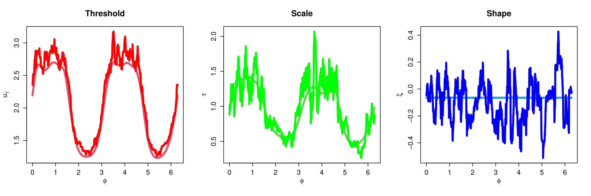
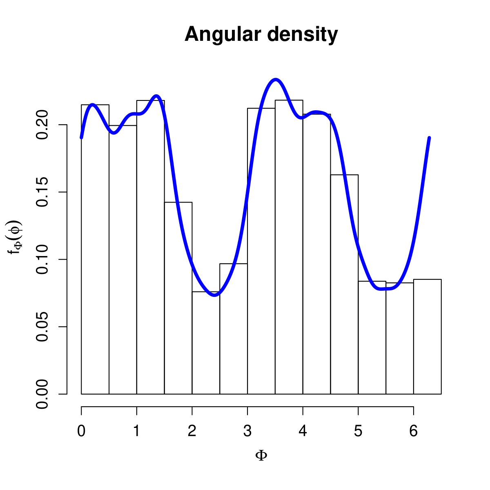
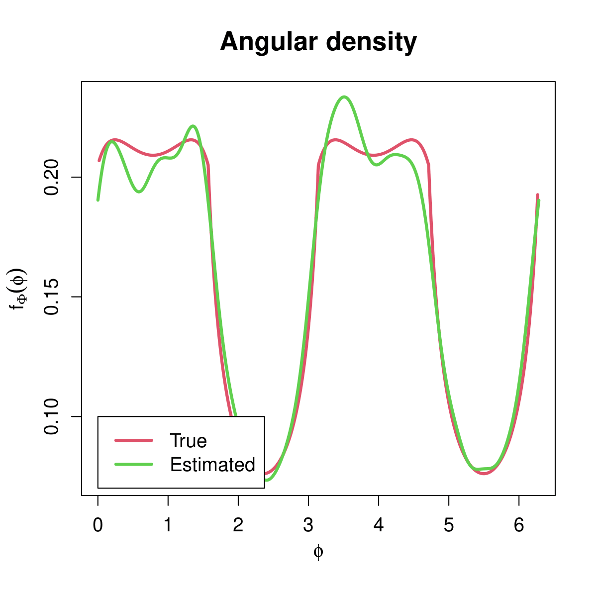
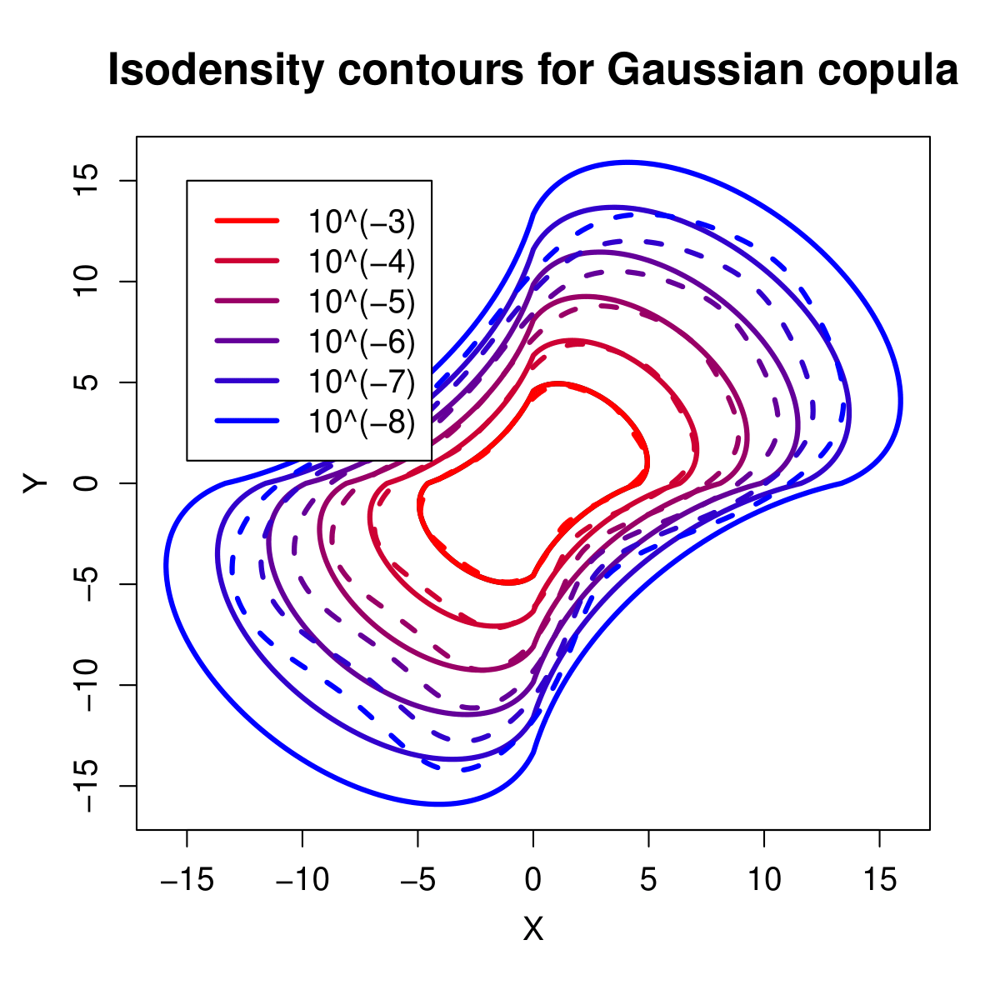
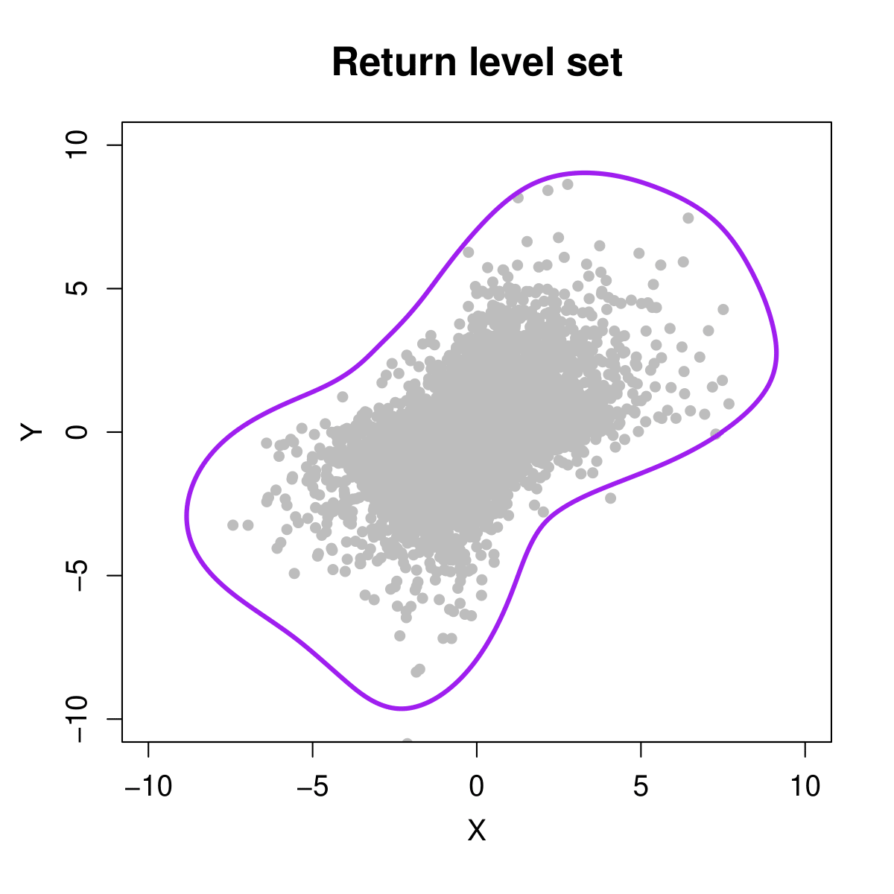
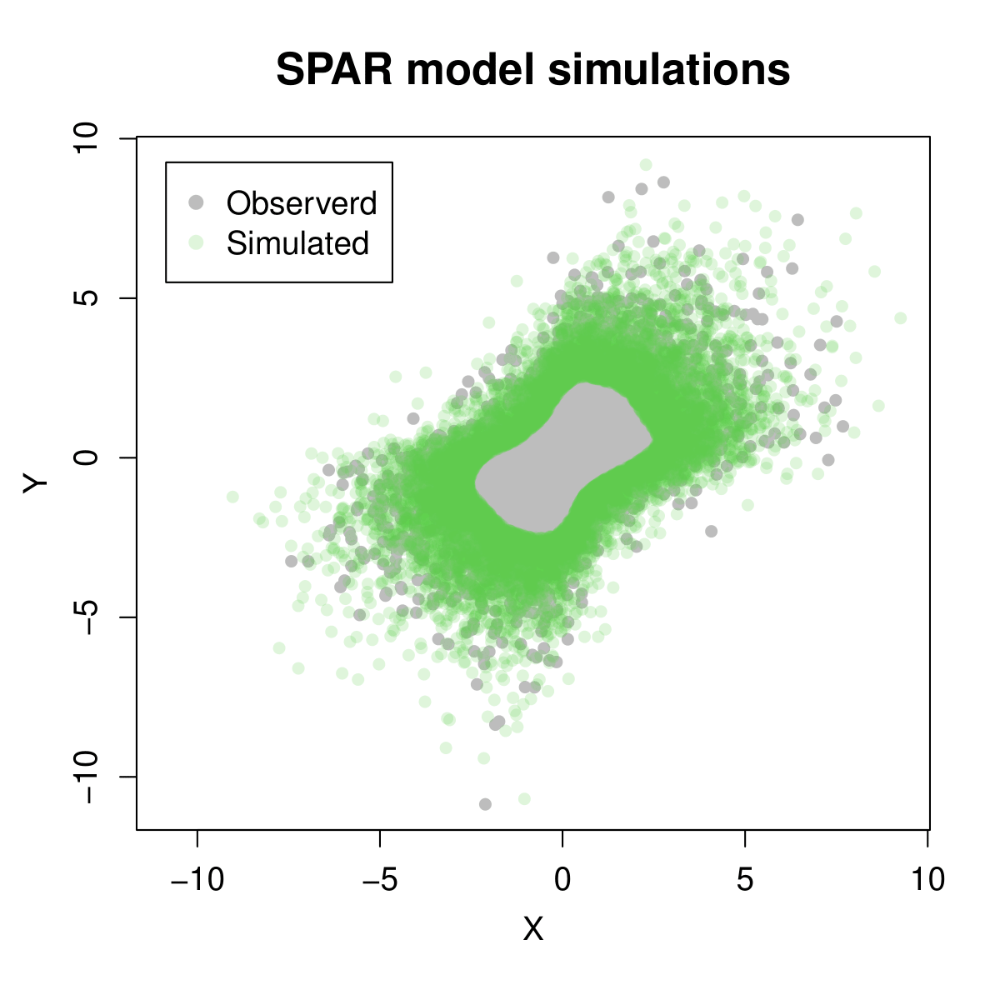

# SPAR
## R Code for the paper "Inference for bivariate extremes via a semi-parametric angular-radial model"

This repository contains the code required for the inference techniques introduced in Murphy-Barltrop et al. (2024). These files can be used to recreate plots from the paper, and to estimate all relevant quantities of interest. 

Below is a demonstration of the code using a polar decomposition (i.e., the Euclidean norm). Note that we also provide functions for an alternative angular-radial decomposition in terms of the $L_1$ norm - see gaussian_data_example.R. **Unless you have a particular reason for using a different norm system, we recommend just sticking with the standard polar decomposition.**  

First, we load in the provided functions and simulate some Gaussian data on Laplace margins.

```r
#load functions
source("master_functions.R")

#we simulate 10,000 points on standard Laplace margins from a bivariate Gaussian copula with correlation coefficient 0.5

n = 10000

d = 2

rho = 0.5

normc = normalCopula(param = rho, dim = d)

set.seed(1)
example_data = apply(rCopula(n, copula = normc),2,Laplace_inverse)

#transformation the data to polar coordinates
polar_data = rect2polar(t(example_data))

polar_data$phi = as.vector(polar_data$phi)

names(polar_data) = c("R","Phi")

polar_data = as.data.frame(polar_data)
```

Next, we fit the SPAR model to the data. This involves two steps - estimating the GPD parameter functions, and estimating the angular density. One must select appropriate tuning parameters for both stages. Note that we estimate the GPD parameter functions using both smooth (GAM-based) and local approaches. 

```r
#The below tuning parameters are recommended values for the SPAR inference. They can be adjusted to alter model fits

#Non-exceedances probability
thresh_prob = 0.8

#Basis dimension/number of spline knots. Higher = more flexibility
k = 25

#Grid of angular points
pred_phi = seq(0,2*pi,length.out=1001)

#Bandwidth for kernel density estimation. Higher = more flexibility
bw = 50

#Number of neighbours for local estimation approach
num_neigh = 300

smooth_fit = SPAR_smooth_polar(sample_data = example_data,thresh_prob = thresh_prob,k=k,pred_phi = pred_phi)

local_fit = SPAR_local_polar(sample_data = example_data,thresh_prob = thresh_prob,pred_phi = pred_phi,num_neigh = num_neigh)

angular_density = SPAR_angular_density_polar(sample_data = example_data,pred_phi = pred_phi,bw = bw)
```

Having computed all SPAR model components, we can now obtain isodensity contours, return level sets and model simulations. This is demonstrated below. 

```r
#density levels for which to evaluate isodensity contours
density_levels = 10^(-(3:8))  

#obtaining isodensity contours
isodensity_contours = SPAR_equidensity_contours_polar(density_levels = density_levels,SPAR_GPD=smooth_fit,SPAR_ang=angular_density)

#return period for evaluating return level set
ret_period = 10 

#number of data points per year (treating the simulations as daily data)
obs_year = 365

#Estimate return level set for desired return period
RL_set = SPAR_ret_level_sets_polar(ret_period = ret_period,obs_year = obs_year,SPAR_GPD=smooth_fit)

#Number of observations to simulate from the SPAR model
nsim = n

#obtaining model simulations
simulated_data = SPAR_simulation_polar(nsim=nsim,SPAR_GPD=smooth_fit,SPAR_ang=angular_density)
```

Finally, you can produce plots diagnostic plots to check the quality of model fits. In the simulated case, one can also compare the estimated components to the truth. A handful of such plots are given below.

### Local vs smooth model fits 



### Angular density diagnostic



### True vs estimated angular density



### Isodensity contour estimates (with truth)



(Don't take such extreme estimates at face value - they require confidence intervals to be meaningful.)

### 10-year return level set estimate



### SPAR model simulations



## Descriptions of each R script

All plots can be easily recreated with the R scripts provided. These scripts can be easily modified to apply the SPAR model to any bivariate data set. A brief description of each script is given below. 

* **master_functions.R** - this file contains all functions and packages required for performing inference
* **gaussian_data_example.R** - this file illustrates how to fit the SPAR model to an L1, or L2, norm decomposition of data from a Gaussian copula
* **gaussian_data_polar_example.R** - this file illustrates how to fit the SPAR model to a polar decomposition of data from a Gaussian copula
* **metocean_data_example.R** - this file illustrates how to fit the SPAR model to the metocean data sets considered in the case study of Murphy-Barltrop et al. (2024). 

The `datafiles' folder contains some .rds files required for running the example scripts.

## Questions?

Please get in touch if you have any questions, or if you find a bug in the code. My email is callum.murphy-barltrop[at]tu-dresden.de 

### **Happy SPAR-ring!**

### References

E. Mackay & P. Jonathan (2023). Modelling multivariate extremes through angular-radial decomposition of the density function. arXiv preprint arXiv:2310.12711.

C. J. R. Murphy-Barltrop, E. Mackay & P. Jonathan (2024). Inference for bivariate extremes via a semi-parametric angular-radial model. Extremes (to appear). 

E. Mackay, C. J. R. Murphy-Barltrop, & P. Jonathan (2025). "The SPAR Model: A New Paradigm for Multivariate Extremes: Application to Joint Distributions of Metocean Variables." Journal of Offshore Mechanics and Arctic Engineering 147.1.
